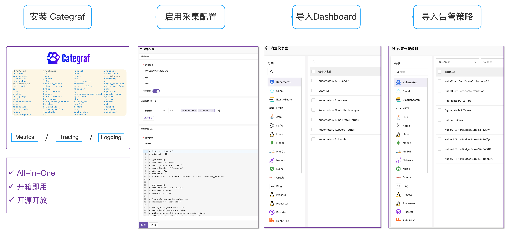

## Categraf

<p align="center">
  <a href="https://github.com/flashcatcloud/categraf">
    </a>
</p>


<p align="center">
  
  
  
  <br/>
  
  
  <a href="https://flashcat.cloud/">  </a>
</p>

Categraf 是一款 All-in-One 的开源的 telemetry 数据采集器，支持指标、日志采集；支持 Tracing 数据的收集；支持物理机、虚拟机、交换机、容器、K8s、多种中间件/数据库的数据采集，支持混合云架构、云原生架构、多云架构。汇聚领域最佳实践，开箱即用。

> ❇️ 我们推荐你使用快猫星云旗下的 [**Flashduty**](https://flashcat.cloud/product/flashduty/) 作为 OnCall 值班平台，Flashduty 支持告警聚合、降噪、认领、升级、排班，让告警的触达既高效，又确保告警处理不遗漏、件件有回响。


> ❇️ 我们推荐你使用 Categraf 作为采集器，搭配 [**夜莺Nightingale**](https://github.com/ccfos/nightingale) 快速构建统一的可观测体系。



## 功能和特点
1. 支持指标、日志的数据采集
2. 支持 Tracing 数据的收集
3. 支持 remote_write 写入协议，支持将数据写入 Promethues、M3DB、VictoriaMetrics、InfluxDB
4. 指标数据只采集数值，不采集字符串，标签维持稳态结构
5. 采用 All-in-One 的设计，所有的采集工作用一个 agent 搞定
6. 纯 Go 代码编写，静态编译依赖少，容易分发，易于安装
7. 尽可能落地最佳实践，不需要采集的数据无需采集，针对可能会对时序库造成高基数的问题在采集侧做出处理
8. 常用的采集器，不但提供采集能力，还要整理出监控大盘和告警规则，用户可以直接导入使用


## 文档

- [快速开始](https://flashcat.cloud/blog/monitor-agent-categraf-introduction/)
- [视频教程](https://mp.weixin.qq.com/s/T69kkBzToHVh31D87xsrIg)
- [FAQ](https://www.gitlink.org.cn/flashcat/categraf/wiki/FAQ)
- [下载最新版本](https://github.com/flashcatcloud/categraf/releases)

## 从源代码编译

```shell
# export GO111MODULE=on
# export GOPROXY=https://goproxy.cn

go build
tar zcvf categraf.tar.gz categraf conf
```


*Note: 对于mac os x 用户，请使用 gun-tar 工具打包*
```shell
brew install gnu-tar
gtar zcvf categraf.tar.gz categraf conf
```

*否则会出现以下报错：*

```F! failed to init config: failed to load configs of dir: ./conf err:toml: line 1: files cannot contain NULL bytes; probably using UTF-16; TOML files must be UTF-8```


## 运行

```shell
# test mode: just print metrics to stdout
./categraf --test

# test system and mem plugins
./categraf --test --inputs system:mem

# print usage message
./categraf --help

# run
./categraf

# run with specified config directory
./categraf --configs /path/to/conf-directory

# only enable system and mem plugins
./categraf --inputs system:mem

# use nohup to start categraf
nohup ./categraf &> stdout.log &
```


## 部署在K8s

Categraf 可以以 daemonset, deployment 或者 sidecar 的形式运行在K8s中。

edit k8s/daemonset.yaml, replace NSERVER_SERVICE_WITH_PORT with service ip:port of nserver in your cluster, replace CATEGRAF_NAMESPACE with namespace value, then run:

```shell
kubectl apply -n monitoring -f k8s/daemonset.yaml # collect metrics, metrics/cadvisor of node
kubectl apply -n monitoring -f k8s/sidecar.yaml # collect service metrics
kubectl apply -n monitoring -f k8s/deployment.yaml #collect apiserver coredns etc
```
Notice: k8s/sidecar.yaml is a demo, replace mock with your own image of service.

## 使用Categraf无缝代替Prometheus抓取数据
see detail [here](https://github.com/flashcatcloud/categraf/blob/main/prometheus/README.md)

## 插件

plugin list and document: [https://github.com/flashcatcloud/categraf/tree/main/inputs](https://github.com/flashcatcloud/categraf/tree/main/inputs) 


## 致谢

Categraf is developed on the basis of Telegraf, Exporters and the OpenTelemetry. Thanks to the great open source community.

## [加入我们的微信群组](https://download.flashcat.cloud/qrcode_sretalk.jpg)