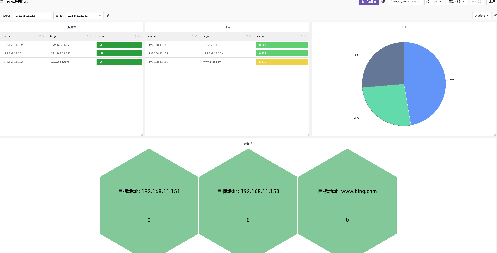

# ping

ping 监控插件，探测远端目标地址能否 ping 通，如果机器没有禁 ping，这就是一个很好用的探测机器存活的手段

## Configuration
这个插件有两种主要的操作方法：`exec` 和 `native`.推荐使用 `native` 方法，因为它具有更好的系统兼容性和性能.
为了向后兼容和更精准的response_ms,`native` 方法是默认的.
使用 `method = "exec"`,将会调用系统ping程序来发送ping packets.

要探测的机器配置到 targets 中，targets 是个数组，可以配置多个，当然也可以拆成多个 `[[instances]]` 配置段，比如：

```
[[instances]]
targets = [ "10.4.5.6" ]
labels = { region="cloud", product="n9e" }

[[instances]]
targets = [ "10.4.5.7" ]
labels = { region="cloud", product="zbx" }
```

上例中是 ping 两个地址，为了信息更丰富，附加了 region 和 product 标签

## File Limit

```sh
systemctl edit categraf
```

Increase the number of open files:

```ini
[Service]
LimitNOFILE=8192
```

Restart Categraf:

```sh
systemctl restart categraf
```

### Linux Permissions

On most systems, ping requires `CAP_NET_RAW` capabilities or for Categraf to be run as root.

With systemd:

```sh
systemctl edit categraf
```

```ini
[Service]
CapabilityBoundingSet=CAP_NET_RAW
AmbientCapabilities=CAP_NET_RAW
```

```sh
systemctl restart categraf
```

Without systemd:

```sh
setcap cap_net_raw=eip /usr/bin/categraf
```

Reference [`man 7 capabilities`][man 7 capabilities] for more information about
setting capabilities.

[man 7 capabilities]: http://man7.org/linux/man-pages/man7/capabilities.7.html

### Other OS Permissions

When using `method = "native"`, you will need permissions similar to the executable ping program for your OS.

## 监控大盘和告警规则

该 README 的同级目录下，提供了 dashboard.json 就是监控大盘的配置，alerts.json 是告警规则，可以导入夜莺使用。

### 新增PING大盘2.0



大盘地址 [dashboard-2.0.json](https://github.com/flashcatcloud/categraf/tree/main/inputs/ping/dashboard-2.0.json)

## Example Output

```text
ping_maximum_response_ms agent_hostname=zy-fat product=n9e region=cloud target=10.0.24.136 0.036
ping_packets_transmitted agent_hostname=zy-fat product=n9e region=cloud target=10.0.24.136 1
ping_packets_received agent_hostname=zy-fat product=n9e region=cloud target=10.0.24.136 1
ping_average_response_ms agent_hostname=zy-fat product=n9e region=cloud target=10.0.24.136 0.036
ping_minimum_response_ms agent_hostname=zy-fat product=n9e region=cloud target=10.0.24.136 0.036
ping_standard_deviation_ms agent_hostname=zy-fat product=n9e region=cloud target=10.0.24.136 0
ping_result_code agent_hostname=zy-fat product=n9e region=cloud target=10.0.24.136 0
ping_percent_packet_loss agent_hostname=zy-fat product=n9e region=cloud target=10.0.24.136 0
ping_ttl agent_hostname=zy-fat product=n9e region=cloud target=10.0.24.136 64
ping_minimum_response_ms agent_hostname=zy-fat product=n9e region=cloud target=www.baidu.com 20.935
ping_average_response_ms agent_hostname=zy-fat product=n9e region=cloud target=www.baidu.com 20.935
ping_standard_deviation_ms agent_hostname=zy-fat product=n9e region=cloud target=www.baidu.com 0
ping_result_code agent_hostname=zy-fat product=n9e region=cloud target=www.baidu.com 0
ping_packets_transmitted agent_hostname=zy-fat product=n9e region=cloud target=www.baidu.com 1
ping_packets_received agent_hostname=zy-fat product=n9e region=cloud target=www.baidu.com 1
ping_ttl agent_hostname=zy-fat product=n9e region=cloud target=www.baidu.com 50
ping_percent_packet_loss agent_hostname=zy-fat product=n9e region=cloud target=www.baidu.com 0
ping_maximum_response_ms agent_hostname=zy-fat product=n9e region=cloud target=www.baidu.com 20.935
```