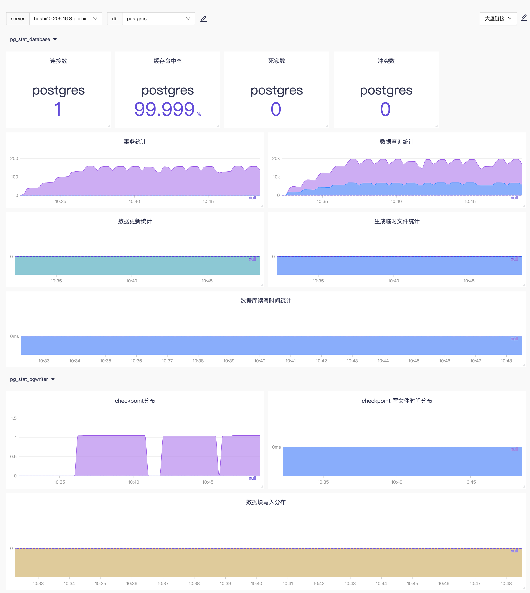

# postgresql

postgresql 监控采集插件，fork 自：telegraf/postgresql 

## configuration

```toml
[[inputs.postgresql]]
address = ""
## postgresql 的连接信息
# address = "host=1.2.3.4 port=5432 user=postgres password=123456 sslmode=disable"

## outputaddress 相当于是addres的别名 
# outputaddress = "db01" 

## 一条连接保持活跃的最大时长， 0s表示永远
## 当查询执行时，到达最大时长的连接不会被立即强制断开
# max_lifetime = "0s"

## 忽略哪些db的采集
# ignored_databases = ["postgres", "template0", "template1"]

## 显式指定采集哪些db 
# databases = ["app_production", "testing"]

## Whether to use prepared statements when connecting to the database.
## This should be set to false when connecting through a PgBouncer instance
## with pool_mode set to transaction.
## 是否使用prepared statements 连接数据库
# prepared_statements = true
```

